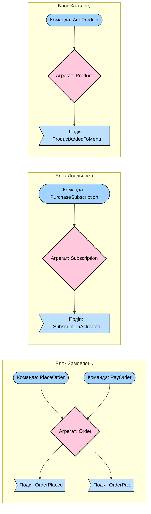
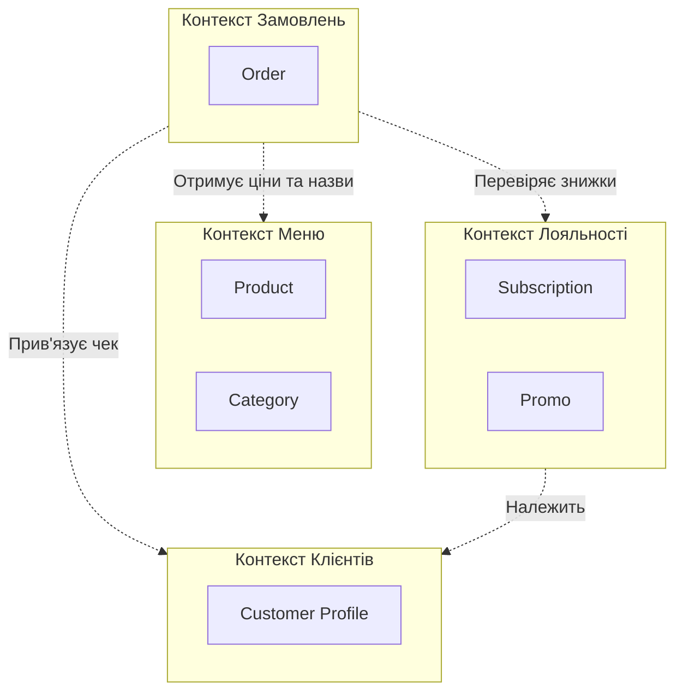

## Склад робочої групи
* **Юрій Горбатий** — Етап 1: Аналіз подій, команд та агрегатів.
* **Євгеній Пригаро** — Етап 2: Проєктування меж контекстів.
* **Олександр Патій** — Етап 3: Формування єдиної мови (словника).

---

## Етап 1: Виявлення подій та команд
**Відповідальний:** Юрій Горбатий

На цьому етапі було виконано аналіз ключових подій, що мають значення для бізнесу, та команд, які ініціюють ці зміни.

### 1. Domain Events (Доменні події)
Це факти, що вже відбулися в системі кав'ярні:
* **OrderPlaced** — Замовлення успішно створене клієнтом.
* **OrderPaid** — Оплату за замовлення підтверджено системою.
* **SubscriptionActivated** — Клієнт придбав та активував кавову підписку.
* **ProductAddedToMenu** — Адміністратор додав нову позицію в каталог.

### 2. Commands (Команди)
Дії користувачів або системи, що призводять до виникнення подій:
* **PlaceOrder** — Намір клієнта зробити замовлення.
* **PayOrder** — Ініціація процесу оплати.
* **PurchaseSubscription** — Запит на оформлення підписки.
* **AddProduct** — Створення нового товару в меню.

### 3. Aggregates (Агрегати)
Логічне групування команд та подій навколо бізнес-понять для забезпечення цілісності даних:
* **Order (Замовлення):** Відповідає за склад замовлення, суму та статус оплати.
* **Subscription (Підписка):** Контролює термін дії та ліміти доступних напоїв.
* **Catalog (Каталог):** Управляє наявністю товарів та їх описом.

### Візуалізація зв'язків (Команда -> Агрегат -> Подія)

---

## Етап 2: Визначення Bounded Contexts (Обмежених контекстів)
**Відповідальний:** Євгеній Пригаро

На цьому етапі систему розділено на 4 логічні зони (Bounded Contexts). Для правильної декомпозиції ми спиралися на евристики: лінгвістичні розриви (різне значення термінів), різні відповідальні особи та розрив у часі.

### 1. Sales Context (Контекст Продажів)
* **Зона відповідальності:** Керування основним транзакційним процесом кав'ярні — від створення кошика до оплати.
* **Обґрунтування меж:** Працює "тут і зараз" з мінімальним розривом у часі. Відповідальність несе касир або система самообслуговування. Товар (Product) тут розглядається виключно як `OrderItem` (позиція в чеку з фіксованою ціною на момент продажу).
* **Основний агрегат:** `Order`.

### 2. Catalog Context (Контекст Каталогу)
* **Зона відповідальності:** Управління асортиментом. Створення карток товарів, категорій та встановлення базових цін.
* **Обґрунтування меж:** Відповідальність несе адміністратор закладу. Зміни в каталозі відбуваються відносно рідко і не впливають на вже закриті чеки у Sales Context.
* **Основні агрегати:** `Product`, `Category`.

### 3. Loyalty Context (Контекст Лояльності)
* **Зона відповідальності:** Управління маркетинговими інструментами: підписками та промокодами.
* **Обґрунтування меж:** Яскраво виражений розрив у часі. Підписка оформлюється один раз, а діє протягом місяця. Відповідальність несе маркетинговий відділ, а логіка підрахунку знижок повністю ізольована від базового каталогу.
* **Основні агрегати:** `Subscription`, `PromoCode`.

### 4. Customer Context (Контекст Клієнтів)
* **Зона відповідальності:** Реєстрація, збереження персональних даних та ведення історії профілю.
* **Обґрунтування меж:** Дані клієнта мають окремий життєвий цикл і існують незалежно від конкретних замовлень.
* **Основний агрегат:** `Customer`.

### Візуалізація карти контекстів (Context Map)

## Етап 3: Створення Ubiquitous Language (Єдиної мови)
**Відповідальний:** Олександр Патій

Метою цього етапу є формування словника термінів, які використовуються як у програмному коді, так і в спілкуванні з бізнесом. У словниках відсутні технічні терміни (наприклад, "Database", "Controller"), натомість використано поняття, зрозумілі замовнику.

### 1. Словник: Sales Context (Продажі)
| Термін | Опис бізнес-поняття |
| :--- | :--- |
| **Order (Замовлення)** | Основний запит клієнта на купівлю товарів. |
| **Order Item (Позиція)** | Конкретний товар у складі замовлення з фіксованою ціною. |
| **Checkout (Оформлення)** | Процес підтвердження замовлення та вибору способу оплати. |
| **Payment (Оплата)** | Підтверджений факт передачі коштів за замовлення. |
| **Status (Статус)** | Поточний етап обробки замовлення (наприклад, "Готується"). |

### 2. Словник: Catalog Context (Каталог)
| Термін | Опис бізнес-поняття |
| :--- | :--- |
| **Product (Товар)** | Одиниця асортименту (напій або десерт) з описом та категорією. |
| **Category (Категорія)** | Група товарів, наприклад "Кава", "Холодні напої" або "Випічка". |
| **Menu (Меню)** | Актуальний перелік усіх доступних для продажу товарів. |

### 3. Словник: Loyalty Context (Лояльність)
| Термін | Опис бізнес-поняття |
| :--- | :--- |
| **Subscription (Підписка)** | Передплачений абонемент, що дає право на отримання певної кількості кави. |
| **Promo Code (Промокод)** | Спеціальна комбінація символів, що надає знижку при замовленні. |
| **Expiration Date (Термін дії)** | Дата, до якої підписка або промокод є дійсними. |

### 4. Словник: Customer Context (Клієнти)
| Термін | Опис бізнес-поняття |
| :--- | :--- |
| **Profile (Профіль)** | Обліковий запис клієнта з його контактними даними. |
| **Contact Info (Контакти)** | Телефон або email, що використовуються для ідентифікації. |
| **History (Історія)** | Список попередніх покупок та активностей клієнта. |

---

### Аналіз омонімів (Терміни з різним значенням)
Згідно з принципами стратегічного DDD, один і той самий термін може мати різні значення у різних контекстах:

* **Product (Товар):**
    * У **Catalog Context** — це маркетингова модель з фото, детальним описом та категорією.
    * У **Sales Context** — це фінансова одиниця в чеку, для якої критичною є лише назва та ціна на момент продажу.
* **Payment (Оплата):**
    * У **Sales Context** — це технічна умова для початку приготування замовлення.
    * У **Loyalty Context** — це подія, яка може бути тригером для нарахування бонусів або продовження підписки.